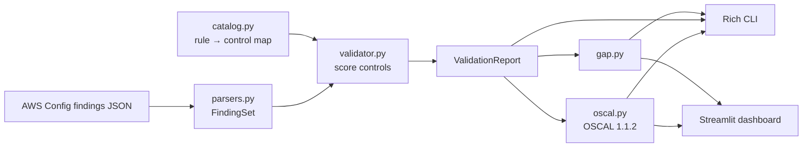
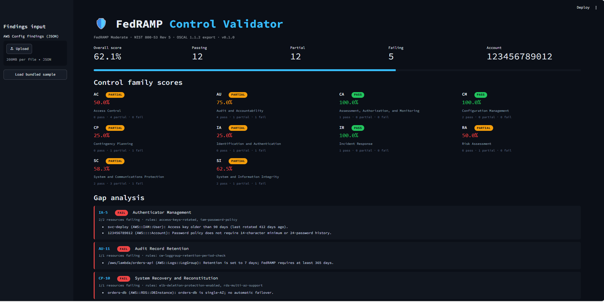
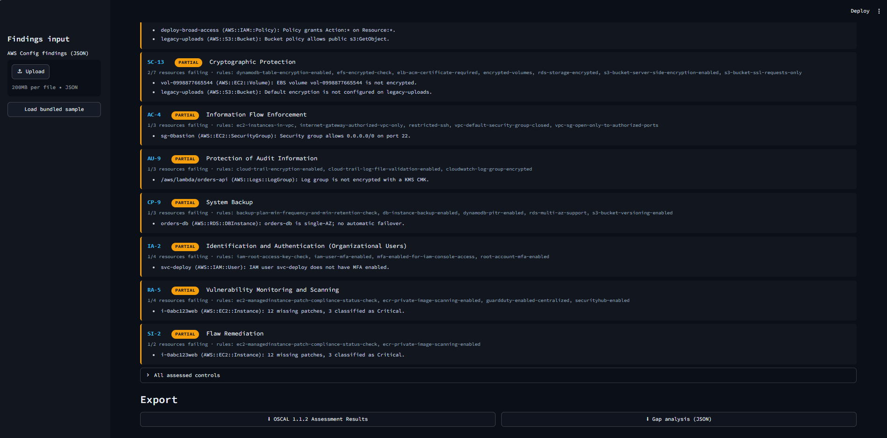

# 🛡️ fedramp-control-validator

> Validate an AWS environment against the **FedRAMP Moderate** baseline
> (NIST SP 800-53 Rev 5), score every control family, generate a gap analysis,
> and export **OSCAL 1.1.2 Assessment Results** — from the terminal or a dark,
> security-operations Streamlit dashboard.

[](https://github.com/JulietRodriguez/fedramp-control-validator/actions/workflows/ci.yml)
[](https://www.python.org/)
[](https://pages.nist.gov/OSCAL/)
[](https://csrc.nist.gov/pubs/sp/800/53/r5/upd1/final)
[](https://www.fedramp.gov/)
[](LICENSE)
[](https://docs.astral.sh/ruff/)

---

`fedramp-control-validator` ingests **AWS Config compliance findings** (mock or
real), maps the underlying Config rules to NIST 800-53 Rev 5 controls, and tells
you — at a glance — where your environment stands against FedRAMP Moderate:
which control families pass, which are partial, which fail, and *why*.

It is intentionally dependency-light (only `rich` and `streamlit`), fully
tested, and produces machine-readable **OSCAL 1.1.2 Assessment Results** that
slot into a broader compliance-as-code toolchain.

## ✨ Features

| Capability | Details |
| ---------- | ------- |
| 🧮 **Control-family scoring** | Scores AC, AU, CM, IA, SC, SI (and CA, CP, IR, RA) as `pass` / `fail` / `partial` with a weighted percentage. |
| 🔎 **Gap analysis** | Lists every failing or partially-satisfied control, the non-compliant resources, and the Config rules that flagged them. |
| 📤 **OSCAL 1.1.2 export** | Emits standards-compliant `assessment-results` with findings, observations, and reviewed-controls. |
| 🖥️ **Rich CLI** | Colorized terminal report with an overview panel, family table, and gap table. |
| 📊 **Streamlit dashboard** | Dark "SOC" theme — score metrics, family cards, gap cards, control table, and one-click OSCAL/gap downloads. |
| 🧩 **Flexible input** | Accepts the bundled simplified shape, native `aws configservice` `EvaluationResults`, or a bare JSON array. |
| 🚦 **CI score gate** | `--fail-under` turns the validator into a pass/fail gate for pipelines. |
| ✅ **Tested** | 40+ pytest cases across the parser, scoring engine, gap analysis, OSCAL exporter, and CLI. |

## 🏗️ Architecture



See [docs/architecture.md](docs/architecture.md) for the module breakdown and
the full scoring model.

## 🚀 Quick start

```bash
# 1. Install (editable, with the test extras)
cd fedramp-control-validator
python -m pip install -e ".[dev]"

# 2. Validate the bundled demo environment
fedramp-control-validator examples/aws_config_findings.json

# 3. Export OSCAL Assessment Results + a gap report
fedramp-control-validator examples/aws_config_findings.json \
    -o assessment-results.json \
    -g gap-analysis.json

# 4. Launch the dashboard
streamlit run src/fedramp_control_validator/dashboard.py
```

> Requires Python 3.9+. The package exposes both a `fedramp-control-validator`
> console script and `python -m fedramp_control_validator`.

## 🖼️ Screenshots





> Screenshots live in [`docs/screenshots/`](docs/screenshots/). Regenerate them
> with `streamlit run src/fedramp_control_validator/dashboard.py`.

## 🧰 CLI usage

```text
usage: fedramp-control-validator [-h] [-o PATH] [-g PATH] [--json]
                                 [--fail-under PCT] [--no-banner] [--version]
                                 [input]

positional arguments:
  input                 Path to an AWS Config findings JSON file.

options:
  -o, --oscal PATH      Write OSCAL 1.1.2 Assessment Results JSON to this path.
  -g, --gap-report PATH Write the gap analysis JSON to this path.
  --json                Print the OSCAL Assessment Results to stdout.
  --fail-under PCT      Exit non-zero if the overall score is below PCT.
  --no-banner           Suppress the ASCII banner.
  --version             Show version and exit.
```

### Example: use it as a CI gate

```bash
# Fail the build if the environment scores below 80% FedRAMP Moderate coverage.
fedramp-control-validator findings.json --no-banner --fail-under 80
```

Exit codes: `0` success · `1` no input · `2` parse error · `3` score below
`--fail-under` threshold.

## 📥 Input format

The simplest accepted shape (see [`examples/aws_config_findings.json`](examples/aws_config_findings.json)):

```json
{
  "account_id": "123456789012",
  "region": "us-east-1",
  "findings": [
    {
      "config_rule_name": "s3-bucket-server-side-encryption-enabled",
      "resource_type": "AWS::S3::Bucket",
      "resource_id": "legacy-uploads",
      "compliance_type": "NON_COMPLIANT",
      "annotation": "Default encryption is not configured."
    }
  ]
}
```

The native AWS CLI shape is also accepted directly — pipe real data in with:

```bash
aws configservice get-compliance-details-by-config-rule \
    --config-rule-name s3-bucket-server-side-encryption-enabled \
    > findings.json
fedramp-control-validator findings.json
```

Bundled samples:

- [`aws_config_findings.json`](examples/aws_config_findings.json) — realistic mixed environment (pass/fail/partial).
- [`aws_config_findings_native.json`](examples/aws_config_findings_native.json) — native `EvaluationResults` shape.
- [`aws_config_findings_clean.json`](examples/aws_config_findings_clean.json) — fully-compliant reference (scores 100%).

## 📤 OSCAL output

The exporter produces a NIST **OSCAL 1.1.2** `assessment-results` document:

- `metadata.oscal-version = "1.1.2"`, account/region props, and an assessor role.
- `import-ap` referencing the FedRAMP Rev 5 Moderate baseline profile.
- One `result` carrying the overall score and per-status counts.
- `reviewed-controls` listing every assessed control (OSCAL lower-case ids).
- A `finding` per control with a `satisfied` / `not-satisfied` objective target.
- An `observation` per non-compliant resource, with the Config rule as evidence.

UUIDs are derived deterministically (UUID5), so re-running over the same
findings yields a stable, diff-friendly document.

## 🗂️ Control coverage

The catalog maps AWS Config managed rules to a curated FedRAMP Moderate subset
across these families:

`AC` Access Control · `AU` Audit & Accountability · `CA` Assessment &
Monitoring · `CM` Configuration Management · `CP` Contingency Planning ·
`IA` Identification & Authentication · `IR` Incident Response · `RA` Risk
Assessment · `SC` System & Communications Protection · `SI` System &
Information Integrity.

The rule → control mapping is modelled on AWS's published *Operational Best
Practices for FedRAMP* conformance pack and lives in
[`catalog.py`](src/fedramp_control_validator/catalog.py) — extend it freely.

## 🧪 Development

```bash
python -m pip install -e ".[dev]"
pytest --cov=fedramp_control_validator --cov-report=term-missing
```

The GitHub Actions pipeline runs the suite on Python 3.9–3.12, smoke-tests the
CLI, asserts the OSCAL version, and enforces the score gate on the clean
reference environment.

## ⚠️ Disclaimer

This tool produces a **draft, automated assessment** to help security engineers
triage gaps quickly. It is not an authoritative control allocation and does not
constitute a FedRAMP authorization. Always have results reviewed by a qualified
assessor (3PAO) before relying on them.

## 📄 License

[MIT](LICENSE) © 2026 Juliet Rodriguez
